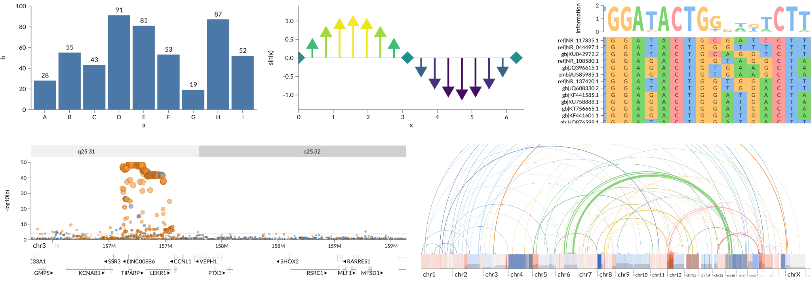

# GenomeSpy

GenomeSpy is a visualization toolkit for genomic (and other) data. It has a Vega-Lite inspired visualization grammar and high-performance WebGL-powered graphics.

The software is still work in progress. Documentation and examples of an early alpha version can be found at https://genomespy.app/

# Contributing

## Bootstrapping and running

1. `git clone git@github.com:tuner/genome-spy.git`
2. `cd genome-spy`
3. `npm install` (use npm7!)
4. `npm start`

The `packages/genome-spy/static/examples` directory contains some random view specification that can be accessed through urls like `http://localhost:8080/?spec=examples/first.json`.

The `packages/genome-spy/private/` directory is in `.gitignore` and served by the development server: `http://localhost:8080/?spec=private/foo.json`. Use it for experiments that should not go into version control.

# Legal stuff etc.

Copyright (c) 2019-2021 Kari Lavikka. See [LICENSE](LICENSE) for details.

GenomeSpy is developed in [The Systems Biology of Drug Resistance in
Cancer](https://www.helsinki.fi/en/researchgroups/systems-biology-of-drug-resistance-in-cancer) group at the University of Helsinki.

This project has received funding from the European Union’s Horizon 2020 research and innovation programme under grant agreement No 667403 for HERCULES
