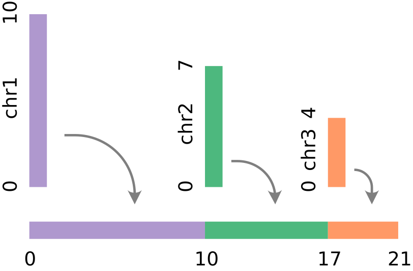

# Genomic Coordinates

{ align=right }

To allow easy visualization of coordinate-based genomic data, GenomeSpy can
concatenate the discrete chromosomes onto a single continuous linear axis.
Concatenation needs the sizes and preferred order for the contigs or
chromosomes. These are usually provided with a genome assembly.

To activate support for genomic coordinates, add the `genome` property with the
name of the assembly to the top level view specification:

```json
{
  "genome": {
    "name": "hg38"
  },
  ...
}
```

!!! warning "Only a single genome assembly"

    Currently, a visualization may have only a single globally configured genome
    assembly. Different assemblies for different scales (for `x` and `y` axes,
    for example) will be supported in the future.

## Supported genomes

By default, GenomeSpy loads genomes from the _genomespy.app_ website. The
following assemblies are provided: `"hg38"`, `"hg19"`, `"hg18"`, `"mm10"`,
`"mm9"`, and `"dm6"`.

## Custom genomes

At minimum, a custom genome needs a list of contigs and their sizes, which
can be loaded from a `"chrom.sizes"` file or provided inline.
[Cytoband](tracks.md#cytoband-track) and [Gene
annotation](tracks.md#gene-annotations) tracks require additional files.

### As files

The `baseUrl` property specifies the location of genomes:

```json
{
  "genome": {
    "name": "hg99",
    "baseUrl": "https://your.site/genomes/"
  },
  ...
}
```

The directory must have the following structure:

```
hg99/hg99.chrom.sizes
hg99/cytoBand.hg99.txt (optional)
hg99/refSeq_genes_scored_compressed.hg99.txt (optional)
```

### Inline

Example:

```json
{
  "genome": {
    "contigs": [
      {"name": "chr3R", "size": 32079331 },
      {"name": "chr3L", "size": 28110227 },
      {"name": "chr2R", "size": 25286936 },
      {"name": "chrX",  "size": 23542271 },
      {"name": "chr2L", "size": 23513712 },
      {"name": "chrY",  "size": 3667352 },
      {"name": "chr4",  "size": 1348131 },
    ]
  },
  ...
}
```

Cytobands and genome annotations cannot be provided inline.

## Encoding genomic coordinates

When a genome assembly has been specified, you can encode the genomic
coordinates conveniently by specifying the chromosome (`chrom`) and position
(`pos`) fields as follows:

```json
{
  ...,
  "encoding": {
    "x": {
      "chrom": "Chr",
      "pos": "Pos",
      "offset": -1.0,
      "type": "locus"
    },
    ...
  }
}
```

The example above specifies that the _chromosome_ is read from the `"Chr"` field
and the _intra-chromosomal position_ from the `"Pos"` field. The `"locus"` data
type pairs the channel with a [`"locus"`](../grammar/scale.md#locus-scale)
scale, which provides a chromosome-aware axis. However, you can also use the
`field` property with the locus data type if the coordinate has already been
linearized. The `offset` property is explained [below](#coordinate-counting).

!!! note "What happens under the hood"

    When the `chrom` and `pos` properties are used used in channel definitions,
    GenomeSpy inserts an implicit
    [linearizeGenomicCoordinate](../grammar/transform/linearize-genomic-coordinate.md)
    transformation into the data flow. The transformation introduces a new
    field with the linearized coordinate for the (chromosome, position) pair.
    The channel definition is modified to use the new field.

    In some cases you may want to insert an explicit transformation to the data
    flow to have better control on its behavior.

## Coordinate counting

The `offset` property allows for aligning and adjusting for different coordinate
notations: zero or one based, closed or half-open. The offset is added to the
final coordinate.

GenomeSpy's [`"locus"`](../grammar/scale.md#locus-scale) scale expects
**half-open**, **zero-based** coordinates.

Read more about coordinates at the [UCSC Genome Browser
Blog](http://genome.ucsc.edu/blog/the-ucsc-genome-browser-coordinate-counting-systems/).

## Examples

### Point features

<div><genome-spy-doc-embed height="80">

```json
{
  "genome": { "name": "hg38" },
  "data": {
    "values": [
      { "chrom": "chr3", "pos": 134567890 },
      { "chrom": "chr4", "pos": 123456789 },
      { "chrom": "chr9", "pos": 34567890 }
    ]
  },
  "mark": "point",
  "encoding": {
    "x": {
      "chrom": "chrom",
      "pos": "pos",
      "type": "locus"
    }
  }
}
```

</genome-spy-doc-embed></div>

### Segment features

<div><genome-spy-doc-embed height="80">

```json
{
  "genome": { "name": "hg38" },
  "data": {
    "values": [
      { "chrom": "chr3", "startpos": 100000000, "endpos": 140000000 },
      { "chrom": "chr4", "startpos": 70000000, "endpos": 170000000 },
      { "chrom": "chr9", "startpos": 50000000, "endpos": 70000000 }
    ]
  },
  "mark": "rect",
  "encoding": {
    "x": {
      "chrom": "chrom",
      "pos": "startpos",
      "type": "locus"
    },
    "x2": {
      "chrom": "chrom",
      "pos": "endpos"
    }
  }
}
```

</genome-spy-doc-embed></div>
