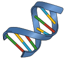

# Working with Genomic Data

{align="right" style="width: 25%"}

GenomeSpy provides various features that are specifically designed for working
with genomic data.

## Loading Genomic Data

While GenomeSpy can load data from various [sources](../grammar/data/index.md),
such as CSV and JSON files, genomic data is often stored in specialized file
formats, such as Indexed FASTA, BigWig, and BigBed. GenomeSpy provides [built-in
support](../grammar/data/lazy.md) for these formats, allowing you to load and
visualize genomic data without the need for additional tools or libraries.

## Handling Genomic Coordinates

Genomic data is typically associated with genomic coordinates comprising
chromosome names and positions within the chromosomes. GenomeSpy provides
various [techniques](./genomic-coordinates.md) for working with such
coordinates, such as
[transforming](../grammar/transform/linearize-genomic-coordinate.md) between
different coordinate systems and visualizing data in the context of a reference
genome.

## Data Transformations

Specialized transformations, such as
[folding](../grammar/transform/regex-fold.md) tabular data, calculating
[coverage](../grammar/transform/coverage.md), and computing a [piled
up](../grammar/transform/pileup.md) layout allows GenomeSpy to be adapted for
many genomic data visualization and analysis tasks.

## GPU-accelerated Rendering

As genomic data can be large and complex, GenomeSpy's GPU-accelerated rendering
allows you to visualize, navigate, and explore large datasets with high
performance.
