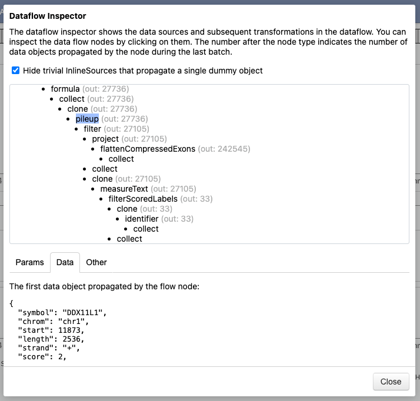

# Data transformation

With transforms, you can build a pipeline that modifies the data before the data
objects are mapped to mark instances. In an abstract sense, a transformation
inputs a list of data items and outputs a list of new items that may be
filtered, modified, or generated from the original items.

The data flow is a forest of data sources and subsequent transformations, which may
form trees. For instance, a layer view might have a data source, which is then
filtered and mutated in a different way for each child layer.

!!! warning "Departure from Vega-Lite"

    The notation of transforms is different from Vega-Lite to enable more
    straghtforward addition of new operations. Each transform has to be
    specified using an explicit `type` property like in the lower-level
    [Vega](https://vega.github.io/vega/docs/transforms/) visualization grammar.
    Thus, the transform type is not inferred from the presence of
    transform-specific properties.

## Example

The following example uses the [`"filter"`](filter.md) transform to retain
only the rows that match the predicate [expression](../expressions.md).

```json
{
  ...,
  "data": { ... },
  "transform": [
    {
      "type": "filter",
      "expr": "datum.end - datum.start < 5000"
    }
  ],
  ...
}
```

## Debugging the Data Flow

{ align="right" width="280" class="screenshot" }

Complex visualizations may involve multiple data sources and transformations,
which can make it difficult to understand the data flow, particularly when no
data objects appear to pass through the flow. The Dataflow Inspector shows the
structure of the data flow and allows you to inspect the parameters of each
node, the number of propagated data objects, and a recorded copy of the first
data object that passes through the node. The Inspector is currently available
in the toolbar (:fontawesome-solid-bug:) of the GenomeSpy [App](../../sample-collections/index.md).
