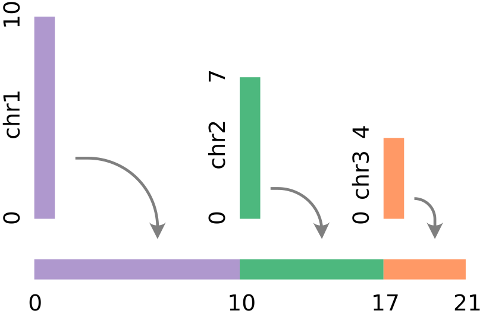

# Linearize Genomic Coordinate

{ align=right }

The `linearizeGenomicCoordinate` transform maps the \(chromosome, position\)
pairs into a linear coordinate space using the chromosome sizes of
the resolved [genome assembly](../../genomic-data/genomic-coordinates.md) of the
channel's locus scale.

## Parameters

SCHEMA LinearizeGenomicCoordinateParams

## Example

```json
{
  "type": "linearizeGenomicCoordinate",
  "chrom": "chrom",
  "pos": "start",
  "as": "_start"
}
```
