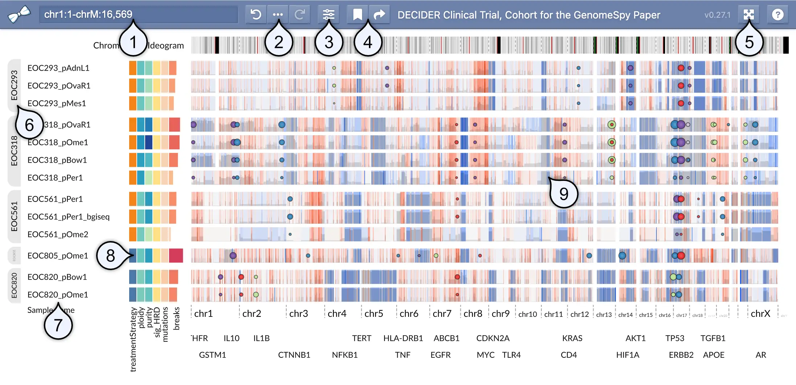
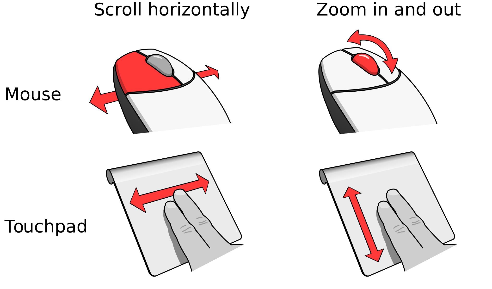
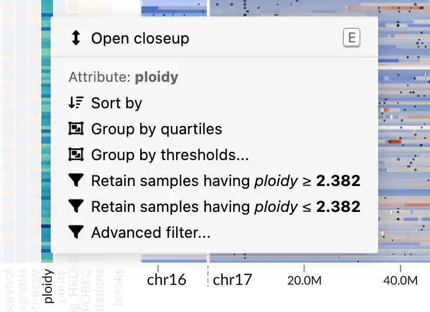
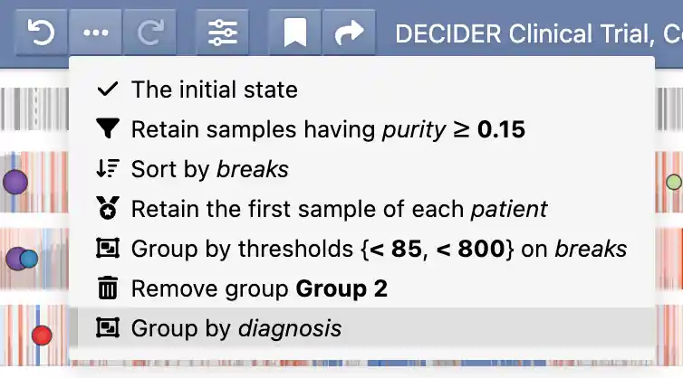
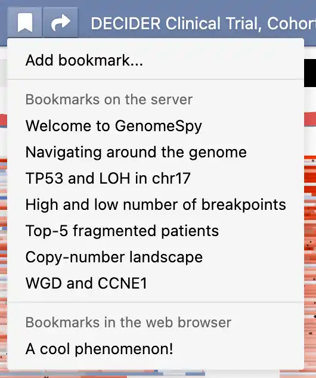

# Analyzing Sample Collections

!!! note "End-User Documentation"

    This page is mainly intended for end users who analyze sample collections
    interactively using the GenomeSpy app.

## Elements of the user interface

Because GenomeSpy visualizations are highly customizable, the actual
visualization and the available user-interface elements may differ significantly
from what is shown below.

{ class="screenshot" }

1. **Location / search field** shows the genomic coordinates of the current viewport
   in a UCSC-style format. You can look up features such as gene symbols using the
   field. In addition, you can filter the sample collection by categorical
   metadata attibutes by typing a categorical value into this field.
2. **Undo history and provenance** allows you to undo and redo actions performed on the
   sample collection. The _provenance_ (:fontawesome-solid-ellipsis:) button shows
   all perfomed actions, allowing you to better understand how the current
   visualization state was constructed.
3. **View visibility menu** allows for toggling the visibility of elements such as
   metadata attributes or annotation tracks.
4. **Bookmark menu** shows a list of pre-defined bookmarks and allows you to save
   the visualization state as a local bookmark into your web browser. The adjacent
   _Share_ (:fontawesome-solid-share:) button constructs a shareable URL, which
   captures the visualization state and optional notes related to the current
   visualization state.
5. **Fullscreen toggle** opens the visualization in fullscreen mode.
6. **Group markers** become visible when the sample collection has been stratified
   using some attribute.
7. **Sample names** identify the samples.
8. **Metadata** such as clinical attributes or computed variables shown as a heatmap.
9. **Genomic data** is shown here.

## Importing metadata

For metadata import workflows (uploading tabular metadata and importing from
preconfigured sources), see [Importing Metadata](importing-metadata.md).

## Navigation interactions

### Navigating around the genome

{ align="right" style="width: 45%; max-width: 350px" }

To navigate around the genome in GenomeSpy, you can use either a mouse or a
touchpad. If you're using a mouse, you can zoom the genome axis in and out using
the scroll wheel. To pan the view, click with the left mouse button and start
dragging.

If you're using a touchpad, you can zoom the genome axis by performing a
vertical two-finger gesture. Similarly, you can pan the view by performing a
horizontal gesture.

### Peeking samples

The GenomeSpy app is designed for the exploration of large datasets containing
hundreds or thousands of samples. To provide a better overview of patterns
across the entire sample collection, GenomeSpy displays the samples as a bird's
eye view that fits them into the available vertical space. If you discover
interesting patterns or outliers in the dataset, you can peek individual samples
by activating a close-up view from the context menu or by pressing the ++e++ key
on the keyboard.

Once the close-up view is activated, the zooming interaction will change to
vertical scrolling. However, you can still zoom in and out by holding down the
++ctrl++ key while operating the mouse wheel or touchpad.

<video autoplay muted controls class="screenshot">
  <source src="../../img/peeking.webm" type="video/webm">
</video>

## Manipulating the sample collection

Sorting, filtering, and stratifying a large sample collection can provide
valuable insights into the data by helping to identify patterns and outliers.
By sorting samples based on a particular attribute or filtering out irrelevant
samples, you can more easily identify patterns or trends in the data that might
be difficult to see otherwise. Stratifying the sample collection by grouping
samples into distinct categories can also help to identify meaningful
differences between groups and reveal new insights into the data.

The GenomeSpy app enables users to manipulate the sample collection using
incremental _actions_ that operate on abstract _attributes_, such as metadata
variables or measured values at specific genomic loci. By applying a series of
these stepwise actions, users can gradually shape the sample collection to their
needs, enabling complex analyses. The applied actions are saved in an _undo
history_, which also serves as _provenance information_ for bookmarks and shared
links.

!!! note "An example scenario"

    Suppose a user has a sample collection that includes multiple tumor samples
    from each patient and wants to keep a single representative sample from each
    patient. The user defines a representative sample as having a tumor *purity*
    greater or equal to 15% and the highest copy number at the *MYC* locus. To
    form a sample collection with only the representative samples, the user
    performs the following actions:

    1. Retains samples with purity greater than or equal to 15%
    2. Sorts the samples in descending order by the copy number at the *MYC* locus
    2. Retains only the top sample from each patient, based on the sorting in Step 2

    Following these steps, the user is left with the representative samples.

### Accessing the actions

{ align="right" width="260" class="screenshot" }

You can access the actions via a context menu, which appears when you
right-click on a metadata attribute in the heatmap or a location in the genomic
data panel.

There are two types of attributes: _quantitative_ and _categorical_. Each type
has a different set of supported actions. For example, quantitative attributes
can be filtered using a threshold, while categorical attributes support
retention or removal of selected categories.

The context menu also provides shortcuts to some actions based on the value
under the cursor. For example, a context menu opened on a categorical attribute
will give you actions for retaining or removing samples with the selected
categorical value.

### The actions

#### Sort

Sorts samples in ascending or descending order by the selected quantitative or
ordinal attribute.

#### Filter by a categorical attribute

Retains or removes samples whose selected attribute has the value under the
cursor. You can also remove samples with missing values. Use _Advanced
filter..._ to choose multiple categories to retain or remove.

#### Filter by a quantitative attribute

Retains samples by comparing the selected attribute to the value under the
cursor. Shortcut actions are available for all comparison operators. You can
also remove samples with missing values. Use _Advanced filter..._ for precise
thresholding with a histogram and open or closed thresholds.

#### Retain values based on another attribute

Retains all samples for category values that have at least one sample matching
a condition on another attribute. For example, after deriving a
`TP53_mutation_count` metadata column, you can keep all samples from patients who
have at least one sample where `TP53_mutation_count > 0`.

The condition can also use categorical attributes. For example, you can retain
patients whose samples include a particular treatment phase. When selecting
multiple categorical values, you can require either _any_ selected value or
_all_ selected values to occur among the samples in the retained category.

#### Group by categorical attribute

Stratifies samples by the selected categorical attribute. The groups are shown
to the left of the sample names, as shown
[above](#elements-of-the-user-interface).

#### Group by custom categories

Creates groups from selected category values. Each custom group can contain one
or more values from the selected attribute.

#### Group by quartiles

Stratifies samples into four groups using the selected quantitative attribute.
The implementation uses the R-7 method, the default in the R programming
language and Excel.

#### Group by thresholds

Stratifies samples using custom thresholds on a quantitative attribute. The
dialog shows a histogram and lets you add any number of thresholds, choose which
side of each threshold is open or closed, and provide custom group titles.

#### Retain the first sample for each category

Retains the first, topmost sample from each category. Sort the samples by the
attribute that should determine the representative samples before using this
action. For a usage example, refer to the _example scenario_ provided in the box
[above](#manipulating-the-sample-collection).

#### Retain first n categories

Retains all samples from the first _n_ category values in the current sample
order. For example, if each patient has multiple samples, you can retain all
samples from the top-5 patients based on the highest number of mutations in
another attribute.

#### Retain values present in all groups

Retains samples whose selected attribute value appears in every current group.
For example, suppose each patient has samples from multiple time points. First
group the samples by time point. Then apply this action to the patient attribute
to keep only patients that have at least one sample in every time point group.
Patients missing one or more time points are removed.

### Undo history and provenance

{ align="right" width="280" class="screenshot" }

GenomeSpy stores the applied actions in an undo history, allowing you to easily
experiment with different analyses and revert back to previous states if needed.
The provenance button (:fontawesome-solid-ellipsis:) reveals a menu that shows
the applied actions together with the used attributes and parameters. You can
jump to different states in the undo history by clicking the menu items or the
adjacent previous/next buttons.

### Selecting related items in genomic tracks

In genomic tracks, the context menu may include a _Select related items_ action
for point selections. This lets you click one item and then select all items
that share the same field value.

For example, if a clicked structural variant has `clusterId = cl121`, you can
select all variants with the same `clusterId`.

The menu shows candidate fields from the clicked datum, focusing on
categorical-like fields (typically non-empty strings and booleans).

When visualizing multiple samples, the menu can offer two scopes:

- _In current sample_: match items in the same sample as the clicked item.
- _Across all samples_: match items regardless of sample.

The operation replaces the active point selection. The action is recorded in
provenance and included in bookmarks, so it can be replayed like other
interactive actions.

## Bookmarking and sharing

Saving a visualization state together with provenance as a bookmark is a
practical way to revisit a particular visualization later or share it with
others. Bookmarks store the entire state of the visualization, including the
actions taken to arrive at that state. This allows for easy and reproducible
sharing of findings from the data. Moreover, bookmarks support optional
[Markdown](https://www.markdownguide.org/basic-syntax/)-formatted notes that
allow communicating essential background information and possible implications
related to the discovery.

### Bookmarks

{ align="right" width="200" class="screenshot" }

GenomeSpy supports two types of bookmarks: pre-defined bookmarks that the
visualization author may have included with the visualization and local
bookmarks that you can save in your web browser. You can access both types of
bookmarks from the bookmark menu (:fontawesome-solid-bookmark:). Additionally,
you can remove or edit existing bookmarks through a submenu that appears when
you click the ellipsis button (:fontawesome-solid-ellipsis-vertical:).

### Sharing

The current visualization state is constantly updated to the web browser's
address bar, allowing you to quickly share the state with others. However, for
better context, GenomeSpy's sharing function provides the option to include a
name and notes with the shared state. Additionally, recipients can conveniently
import the shared link into their local GenomeSpy bookmarks. You can share the
current state by clicking on the _Share_ (:fontawesome-solid-share:) button, or
share an existing bookmark by selecting the _Share_ option from the bookmark's
submenu.
