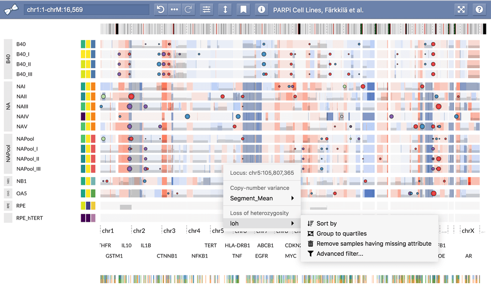

# Working with Sample Collections

The **app** package of the GenomeSpy toolkit enables an interactive analysis of
large sample collections. It builds upon the core package, which allows
developers to build tailored visualizations using the visualization grammar and
GPU-accelerated rendering engine. The app extends the grammar with a _facet_
operator that makes it possible to repeat a single visualization for thousands
of samples. The end users of the visualization have access to several
interactions that facilitate the exploration of such sample collections.

The documentation of the app package is split into two parts serving different
audiences:

1. [Visualizing Sample Collections](visualizing.md) (for method developers)
2. [Analyzing Sample Collections](analyzing.md) (for end users)
