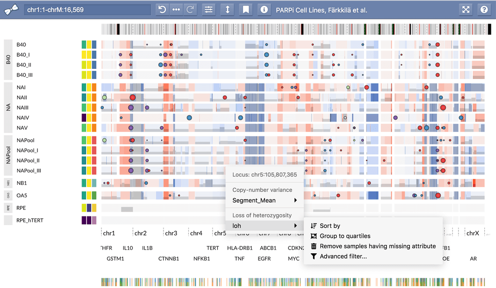

# GenomeSpy App for Genomic Sample Collections

GenomeSpy App is a configurable visual analysis environment for exploring
genomic data across large sample collections, such as cancer cohorts. It builds
on GenomeSpy Core and its declarative visualization grammar, allowing
visualization authors to combine genomic measurements, clinical variables, and
other metadata in views tailored to a research question. End users can then
explore those views in the browser without modifying the visualization
specification.

## What you can do with GenomeSpy App

- scan hundreds or thousands of samples for cohort-wide patterns, then open a
  close-up view to inspect interesting samples and outliers;
- navigate the genome and examine genomic measurements alongside sample
  metadata;
- sort, filter, and group samples through incremental, reversible actions;
- compare groups using summaries that update with the visible samples;
- add metadata during an analysis and control which tracks and attributes are
  visible; and
- save and share findings as bookmarks that preserve the view, analysis steps,
  and optional notes.

## Choose your documentation

The App documentation serves two audiences:

For end users analyzing sample collections:

1. [Analyzing Sample Collections](analyzing.md)
2. [Importing Metadata](importing-metadata.md)

For visualization authors creating and configuring tailored applications:

1. [Visualizing Sample Collections](visualizing.md)
2. [Configuring App Features](app-features.md)
3. [Configuring Metadata Sources](metadata-sources.md)
4. [Sample View Parameters](sample-view-parameters.md)
5. [Aggregating Samples](aggregating-samples.md)
