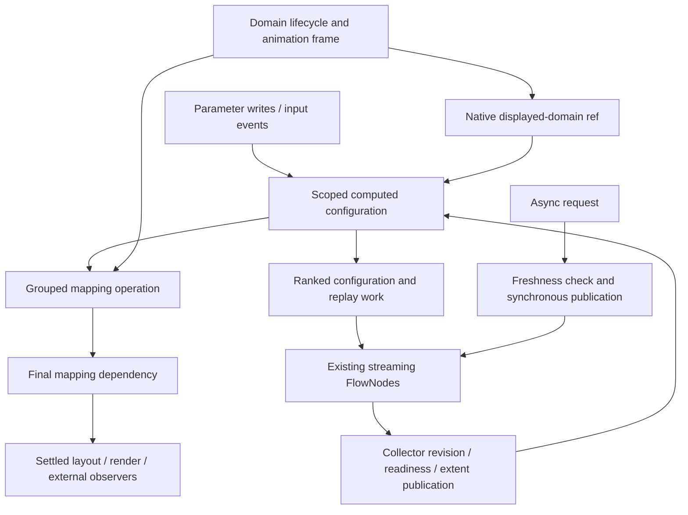

# First-class internal reactivity

Status: M1–M3 implemented and verified, 2026-09-06.
The [bonus milestone](bonus-milestone.md) closes branch-review gaps; M4 remains deferred.
Branch: `refactor/more-reactivity`, based on `720f1f8b384b929276b652ed89c5ef6e4a7878c6`.

## Recommendation

Make the existing reactive runtime the normal way to express internal derived
state and coordinated configuration. Retain streaming FlowNodes for rows, the
domain lifecycle owner for navigation and animation, and Redux for App intent
and provenance. Replace the remaining independent coordination paths in bounded
vertical slices; do not install another runtime or rewrite everything as signals.

The next slice should migrate existing reactive scale ranges into a grouped,
graph-owned mapping operation. Use band/index padding/paddingInner/paddingOuter as an internal
acceptance fixture, without requiring a public reactive-padding feature. Follow
with declared streaming side-input publication and asynchronous URL generations.
The [concrete refactor plan](next-refactors.md) specifies outcomes and gates.

## Expected benefits

The central payoff is making correctness local: scale authors describe scale
configuration, transform authors describe row processing, and source authors
describe request publication. Each needs less knowledge of unrelated scheduling
mechanisms because the runtime owns dependency ordering and coherent observation
for migrated consumers.

Today, a reactive property can require subscriptions, batching, cache invalidation,
notifications and disposal logic. The intended architecture lets a consumer declare
its inputs and how to apply their settled values. This should provide:

- **Less plumbing for features:** reactive range configuration, padding and similar
  properties become small grouped consumers. Adding a property should not require
  another event channel, refresh cascade or scheduling mechanism.
- **Consistent visible state:** related writes produce a coherent configuration
  before downstream consumers observe it. CPU geometry, GPU inputs and scale
  expressions remain aligned during zoom and animation.
- **More reliable data updates:** lookup and cross share replay and readiness
  coordination. Generation-protected URL publication prevents superseded loads
  from overwriting newer results or incorrectly reporting completion.
- **Less redundant work:** unchanged computed results can stop propagation, and
  shared dependencies can coalesce repeated updates. Performance gains must be
  measured; broader invalidation or graph overhead could offset them.
- **Easier debugging and maintenance:** explicit dependencies explain why a
  consumer updates, while clear ownership makes replacement and disposal easier
  to reason about. This reduces the number of independently maintained consistency
  rules that a change can accidentally violate.

Animation, navigation, loading and layout still require lifecycle policy. The goal
is to express that policy under clear owners and remove duplicated coordination
around it. These benefits accrue as consumers migrate; adding runtime primitives
alone does not establish them throughout GenomeSpy.

The first scale-mapping refactor is the proof point: it must delete existing
wiring, preserve same-frame behavior, and make a second grouped property
substantially easier to add. Moving callbacks into additional abstractions without
reducing coordination would not demonstrate success. The concrete plan's deletion
targets, consistency tests and measurements make these expectations reviewable.

## Issue history and present baseline

Read [issue #463](https://github.com/genome-spy/genome-spy/issues/463) and all five
comments returned by GitHub on 2026-09-05:

1. [Padding experiment](https://github.com/genome-spy/genome-spy/issues/463#issuecomment-5292851786):
   grouped properties, lexical scope, same-frame mapping, bootstrap, feedback,
   and excessive plumbing are the acceptance problem.
2. [Vega investigation](https://github.com/genome-spy/genome-spy/issues/463#issuecomment-5292959088):
   explicit inputs and grouped scale evaluation explain why Vega needs less
   property-specific machinery. Whole-scale dependencies also reject useful
   same-scale domain-to-range relationships.
3. [Synchronous foundation proposal](https://github.com/genome-spy/genome-spy/issues/463#issuecomment-5551252304):
   preserve streaming execution, displayed animation domains, readiness, and
   synchronous calibration; asynchronous freshness is separate.
4. [Post-#508 update](https://github.com/genome-spy/genome-spy/issues/463#issuecomment-5552900871):
   the shared runtime now coordinates the migrated domain paths and Filter/Formula
   replay. Grouped properties are the recommended next experiment.
5. [Lookup/cross follow-up](https://github.com/genome-spy/genome-spy/issues/463#issuecomment-5553039674):
   declared side edges should own replay and consumed-revision coordination.

The checkout contains that foundation. Earlier discussion of missing capabilities
must not be treated as a description of today's entire implementation. In
particular, anonymous signals/computeds/effects, equality options, replay
coalescing, a propagation barrier, and a native displayed-domain ref already exist.

## What comparable systems contribute

These are design comparisons, not proposals to copy source code. Links below are
primary documentation or implementation sources; RxJS source is pinned to 7.8.2
because its documentation site returned only a JavaScript shell.

| System                                                                                                                                                                                                                            | Useful mechanism                                                                                   | Fit and limitation for GenomeSpy                                                                                                                                                                                                         |
| --------------------------------------------------------------------------------------------------------------------------------------------------------------------------------------------------------------------------------- | -------------------------------------------------------------------------------------------------- | ---------------------------------------------------------------------------------------------------------------------------------------------------------------------------------------------------------------------------------------- |
| [Vega signals](https://vega.github.io/vega/docs/signals/) and [scale parser](https://raw.githubusercontent.com/vega/vega/main/packages/vega-parser/src/parsers/scale.js)                                                          | Compile declarative references into operator inputs; marshal a related property set together.      | Closest architectural precedent. Adopt explicit edges and grouped evaluation while retaining GenomeSpy's row pipeline and GPU design.                                                                                                    |
| [Vega scheduler](https://raw.githubusercontent.com/vega/vega/main/packages/vega-dataflow/src/dataflow/run.js)                                                                                                                     | Ranked queue, pulse stamps, and reranking checks; asynchronous work has explicit scheduling paths. | A useful consistency boundary, not proof of latest-wins network publication. Its once-per-pulse behavior assumes the relevant stable graph; do not promise once for arbitrary feedback.                                                  |
| [Preact Signals](https://preactjs.com/guide/v10/signals/)                                                                                                                                                                         | Cached derived values, nested batches, disposal, and tracked reads.                                | Good small internal API precedent. Its lazy reads and initial effect execution differ from GenomeSpy's eager computeds and change-triggered effects. A package swap is not mechanically compatible.                                      |
| [Preact implementation discussion](https://preactjs.com/blog/signal-boosting/)                                                                                                                                                    | Dependency tracking and avoiding unnecessary computation.                                          | Useful later if profiling justifies demand-driven evaluation. First remove duplicate scheduling; do not add automatic tracking to the per-row path.                                                                                      |
| [RxJS combineLatest](https://raw.githubusercontent.com/ReactiveX/rxjs/7.8.2/src/internal/observable/combineLatest.ts) and [switchMap](https://raw.githubusercontent.com/ReactiveX/rxjs/7.8.2/src/internal/operators/switchMap.ts) | Compose event streams and switch to a new inner subscription.                                      | Useful async policy vocabulary. combineLatest emits after individual input emissions, so it does not provide atomic multi-parameter transactions. Unsubscription only cancels underlying work when its producer implements cancellation. |
| [Solid fine-grained reactivity](https://docs.solidjs.com/advanced-concepts/fine-grained-reactivity) and [batch](https://docs.solidjs.com/reference/reactive-utilities/batch)                                                      | Signals, memos, tracked dependency changes, and bounded synchronous batching.                      | Useful ownership and derivation patterns. Batching does not extend past asynchronous suspension; a resource lifecycle remains necessary.                                                                                                 |
| [MobX computeds](https://mobx.js.org/computeds.html)                                                                                                                                                                              | Derive state instead of mirroring it; configurable comparison and suspended unused derivations.    | Supports choosing small value-specific equality contracts. Broad observable object mutation would obscure GenomeSpy's explicit state owners.                                                                                             |

Recommendation inferred from this comparison: keep explicit dependencies as the
default, use a small signal/computed vocabulary, and adopt Vega's operator-style
configuration boundary. Consider automatic dependency tracking only if real
consumers remain substantially harder to express after this migration.

No external code is copied or closely adapted here. Before any such implementation
or dependency adoption, verify the exact revision's license compatibility and
retain required notices and durable provenance links.

## Codebase opportunities

Paths below are relative to the repository root. These findings come from source
inspection; this planning task does not claim a new browser reproduction.

| Area               | Current evidence                                                                                                                                                                                                        | Proposed simplification                                                                                                                                       |
| ------------------ | ----------------------------------------------------------------------------------------------------------------------------------------------------------------------------------------------------------------------- | ------------------------------------------------------------------------------------------------------------------------------------------------------------- |
| Graph              | `packages/core/src/paramRuntime/graphRuntime.js`: ranked computeds, queued publication jobs, then one effect; stabilization resumes after writes. Ranks are set from dependencies at creation.                          | Extend only the missing producer/output contract needed by grouped configuration; keep one scheduler.                                                         |
| Expressions        | `paramRuntime/expressionRef.js`: subscriptions directly forward dependency notifications. `paramRuntime/paramUtils.js`: `activateExprRefProps` maintains altered-property sets and separate microtask/barrier batching. | Graph-bound non-datum expression values and one grouped configuration consumer; retain raw subscriptions only as invalidation ingress.                        |
| Scale mapping      | `scales/scaleInstanceManager.js`: `resolveRange` subscribes per expression, applies the range directly, tracks listeners, and patches scale setters.                                                                    | Bind the complete configuration once; apply and publish mapping once from settled inputs. Delete replaced range listeners and internal notification cascades. |
| Scale helpers      | `utils/expression.js`: `domain()` uses the native domain ref, while other helpers use event adapters with rank zero.                                                                                                    | Give final mapping a real producer dependency; preserve the distinct domain dependency.                                                                       |
| Scope and topology | `scales/scaleResolution.js` resolves expressions through its scope logic and reconfigures shared participants.                                                                                                          | Use the existing effective resolution scope; preserve shared-owner lookup and single-member compatibility. Rebuild bindings when participants change.         |
| Streaming          | `data/flowNode.js` already deduplicates replay roots for Filter/Formula. `data/transforms/lookup.js` and `cross.js` still observe foreign collectors and manage readiness/replay locally.                               | One declared dependency/publication protocol; keep indexing, self-buffering, and cross-product processing local.                                              |
| Async sources      | `data/sources/urlSource.js`: `load` resets before awaiting descriptors/fetch/parsing, then guards rows/status/completion with a source-local load counter.                                                              | Source-local load counter guards rows, status and completion once a replacement load starts; preserve reset-at-start behavior.                                |
| Layout             | `view/view.js`: explicit domain listeners for step sizing and ancestor cache-prefix invalidation. Directly constructed App views require equivalent wiring.                                                             | Derive size demand from explicit inputs and topology; centralize layout invalidation before pursuing incremental layout.                                      |
| Render boundary    | Core architecture separates completed `LayoutResult` from retained backend resources and collector/mark revisions.                                                                                                      | Render/export/picking consume one settled state; keep GPU resources and row buffers outside value-level reactivity.                                           |
| App                | `packages/app/APP_ARCHITECTURE.md`, `sampleView/metadata/derivedMetadataConfigurator.js`: intent/readiness orchestration and cached observed domains.                                                                   | Later derive transient metadata/readiness from Core publication facts; retain serializable Redux intents and undo history.                                    |

Unprefixed paths in the table's Core rows are under `packages/core/src/`.

## Intended architecture and contracts

The signal/dataflow round trip is a scheduling relationship, not permission for
arbitrary cycles in the value graph. A replay consumes settled inputs and publishes
a new completed revision; that publication can trigger another bounded round.

- **Values versus events:** state is a readable ref; computeds derive state;
  commands mutate its owner. Raw listeners invalidate work rather than read and
  publish multi-input state. External events are emitted after coherent commits.
- **Grouped configuration:** all related values are evaluated and validated
  before mutating the live consumer. A real output dependency represents that
  consumer's completed update. Merely running a terminal effect that writes an
  unrelated rank-zero signal does not encode the producer relationship.
- **Equality:** retain current scalar identity semantics initially. Use explicit
  shallow element comparators for small domain/range arrays and field comparison
  for configuration records. Do not deep-compare datasets or assume a mutable D3
  function changes identity. Mapping publication needs a semantic revision or a
  changed configuration value. Document NaN behavior rather than silently changing
  all existing equality semantics.
- **Timing:** nested transactions group source writes. Synchronous interaction
  and immediate-render boundaries explicitly flush after the outer transaction.
  Ordinary asynchronous scheduling may retain its existing microtask behavior.
  No blanket delay is introduced into zoom or animation.
- **Observation:** one ordinary batch produces one final grouped application if
  its inputs settle without feedback. Effects that write inputs initiate further
  rounds; arbitrary effects are not collectively atomic. `whenPropagated` covers
  synchronous graph/replay work, not future network responses or animation frames.
- **Ownership:** views/resolutions own bindings, nodes, jobs, and disposal.
  Scale configuration uses the existing effective resolution scope, preserving
  shared-owner lookup and single-member compatibility. Ordinary parameter
  expressions retain lexical scope; lifetime may belong to another owner.
  Replace owned bindings at a transaction boundary, cancel obsolete queued work,
  and reconnect downstream edges with correct ranks. Do not mutate dependencies
  in place while retaining cached ranks.
- **Cycles:** retain valid displayed-domain-to-range dependencies. Reject mapping
  feedback through bandwidth(), scale() or invert() into its own configuration,
  including indirect paths. The grouped padding fixture uses band/index scales;
  continuous padding remains part of domain normalization.
  Diagnose declarative graph cycles at binding time; retain the runtime's bounded
  non-settling diagnostic for imperative signal/replay feedback. Bootstrap guards
  are still necessary until inputs exist; do not evaluate datum expressions early.
- **Failures:** preserve current failed-flush/barrier behavior. Validate before
  live mutation, discard queued publication on failure/disposal, and do not add
  rollback/retry machinery to simulate arbitrary atomic imperative effects.
- **Domain policy:** readiness, initial reference, reset target, navigated display,
  and animation identity remain distinct state in their existing owner. Signals
  should expose these facts, not duplicate or erase their lifecycle semantics.

## Longer-term direction

1. Establish grouped configuration and native mapping dependencies, then reuse
   them for other non-datum ExprRef consumers. Delete each superseded path as its
   consumer migrates; do not make a second compatibility implementation permanent.
2. Make declared primary/side data dependencies drive publication and readiness.
   Add targeted branch replay only once the shared protocol makes its correctness
   explicit. Tuple-level incremental changesets remain a separate performance idea.
3. Guard superseded eager URL loads with a source-local counter; preserve loading policy.
   Eager replacement and lazy window caches need different resource identities;
   a global epoch must not discard useful independent viewport fetches.
4. Make layout inputs and invalidation explicit. Preserve full arrangement and
   the ephemeral LayoutResult initially. Step demand, viewport allocation, axis
   measurement and scrollbar feedback need distinct stages, not a cyclic size ref.
5. Converge rendering, picking, and export on settled layout/mapping/mark revisions.
   Profile before splitting mapping invalidation by property or introducing
   incremental layout. Preserve fast callable mappings on per-datum CPU paths.
6. Expose transient Core readiness and metadata derivations to App through narrow
   adapters. Redux remains the owner of user intent/provenance; no reactive graph
   is serialized into bookmarks or used as a replacement undo system.

## Non-goals, risks, and open decisions

Non-goals: a framework migration; reactive objects for every datum; a retained
scene graph; public reactive padding in the first slice; replacing domain animation
with scalar smoothing; broad recovery/retry support; a full Vega grammar clone.

Main risks are hiding dependency edges behind callback jobs, scope changes during
property binding, mapping/layout feedback, eager bootstrap evaluation, redundant
GPU uploads from coarse invalidation, and changing async loading presentation.
Each is addressed by a concrete acceptance gate in the next-refactor plan.

Scope decision (2026-09-05): use resolution scope, preserving current shared-scale
behavior and the existing single-member compatibility path. Per-property declaration
scope is not part of this refactor. M1 migrates range(), bandwidth(), scale() and
invert() together; linearize() retains coordinate-conversion semantics.

Decisions to resolve at the first shared-contract review:

- The smallest producer-bearing operation representation within GraphRuntime:
  extend an existing node or add one internal node kind. It must expose edges for
  rank/cycle analysis and complete publication before downstream readers run.
- Whether topology replacement rebuilds the affected downstream bindings or
  reranks them. Prefer rebuilding a bounded owned region initially; measure shared
  resolution cases before committing to a generic dynamic graph algorithm.
- Which existing public/raw scale mutation surfaces require compatibility. Audit
  actual callers before removing setter interception; keep any necessary bridge
  at the API boundary, not on internal configuration paths.
- Default async presentation: propose retaining last completed data while loading,
  but report it as stale for availability checks. Confirm compatibility with eager
  loading UI and error handling in the async milestone before implementation.

Success means fewer manually maintained subscriptions, invalidation cascades and
coordination fields, with explicit owners and observable consistency guarantees.
The graph becoming larger is not itself evidence of a simpler architecture.
